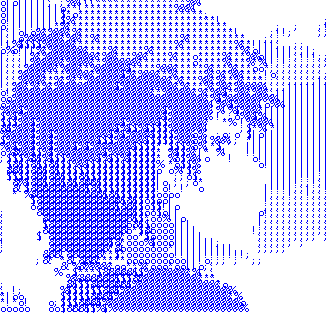
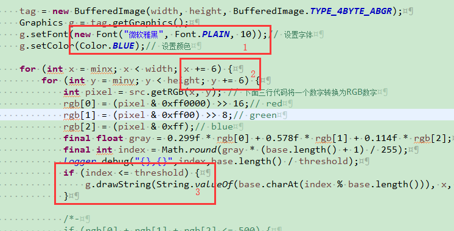
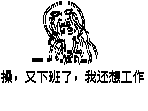
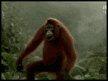
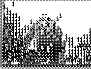
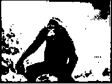

## 目录
1. [图片转图片](#图片转图片)  
   [参数调整](参数调整)  
2. [gif转gif](#gif转gif)  
3. [视频转视频](#视频转视频)  


<h2 id="图片转图片">图片转图片</h2>  
> 

   

```java
    @Test
    public static void imgTest() {
        String inputFile = "F:/123/head.png";
        String outputFile = "F:/123/head_copy.png";
        // String base = "01"; // 替换的字符串
        String base = "@#&$%*o!;.";// 字符串由复杂到简单
        int threshold = 8;// 阈值
        ImgUtil.toTextImg(inputFile, outputFile, base, threshold);
    }
```

<h2 id="参数调整">具体参数调整如下图所示：</h2>  
  
1. 调整字符大小，颜色  
2. 调整字符间距  
3. 调整字符的区域  （index数值越小，灰度越大）  


<h2 id="gif转gif">gif转gif</h2>  
> GifUtil.java  

   
    

测试代码
```java
    @Test
    public static void gifTest() {
        String srcFile = "F:/123/123.gif";
        String targetFile = "F:/123/123_04.gif";
        String base = "01"; // 替换的字符串
        // String base = "@#&$%*o!;.";// 字符串由复杂到简单
        int threshold = 3;// 阈值
        GifUtil.toTextGif(srcFile, targetFile, base, threshold);
    }
```


<h2 id="视频转视频">视频转视频(未完成)</h2> 
> FfmpegUtil.java


